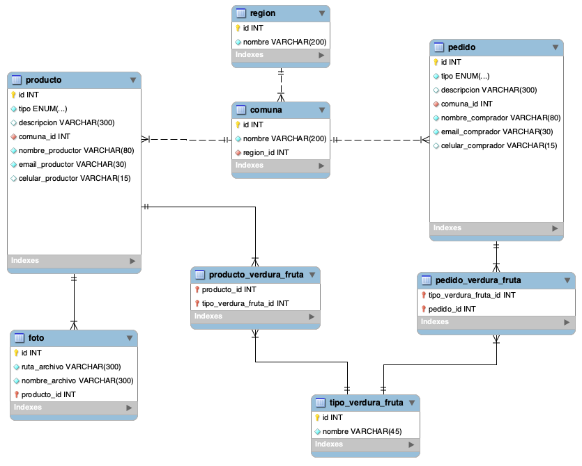

# Tarea 2

Los principales objetivos de esta tarea es desarrollar la misma página web de la tarea 1 pero utilizando el Framework Flask junto con conectar esta página con una base de datos local utilizando MySQL.

La creación de la base de datos, asi como las tablas que la componen, han sido provistas aquí : [enlace](database/)

Puede revisar el enunciado de la tarea aquí : [enlace](EnunciadoTarea2.pdf)
